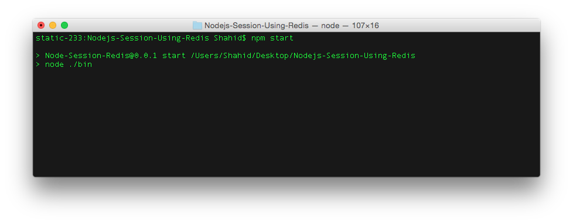
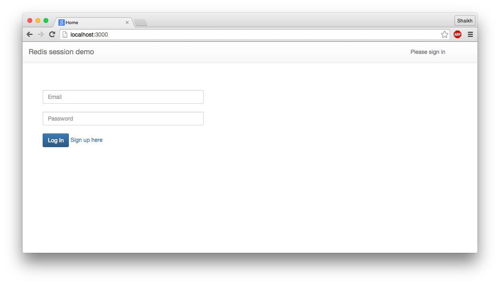
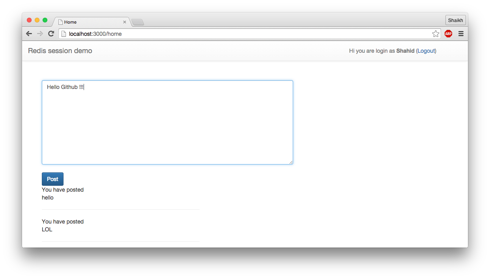
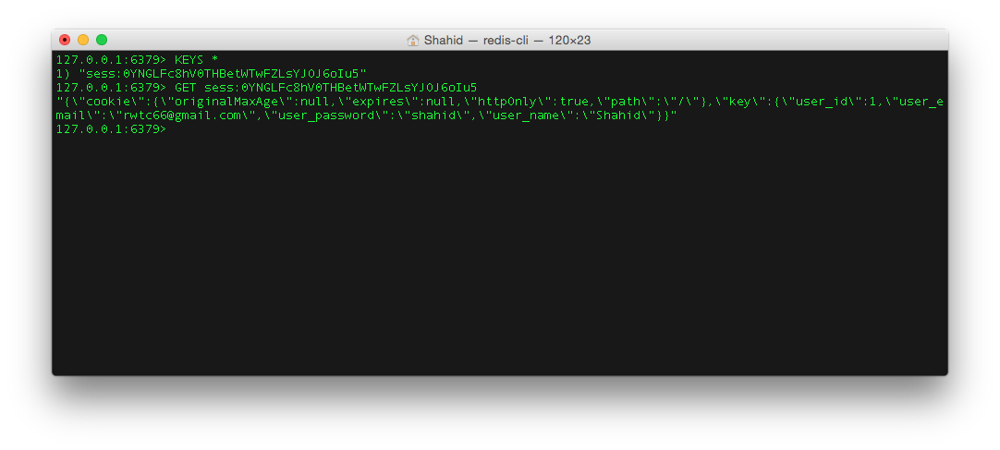
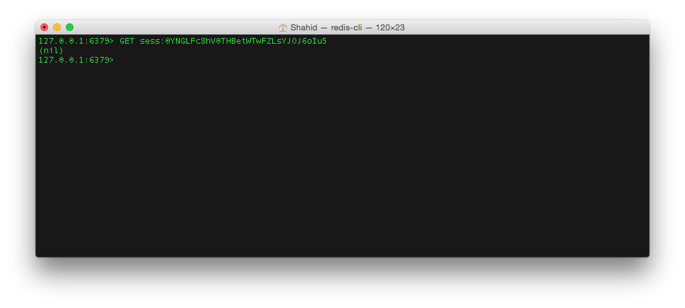

# Hanndle Node.js Session using Redis
Handling Session in app is not good practice for production environment. In case of concurrent and distributed environment we need more reliable and stable source of Session storage. Redis is one of the fastest and widely used key storage database software. This project will demonstrate how to incorporate Redis into ExpressJS application to handle Session.

#Tutorial link

https://codeforgeek.com/2015/07/using-redis-to-handle-session-in-node-js/

## How to run.

Download Redis and start it on default port.

Import the database file (.sql) to redisDemo database via PHPMyadmin.

Run ```npm start``` in terminal and visit app at localhost:3000.

## Screenshots.

### Starting the app


### Login


### After login screen


### Redis data


### After logging out

